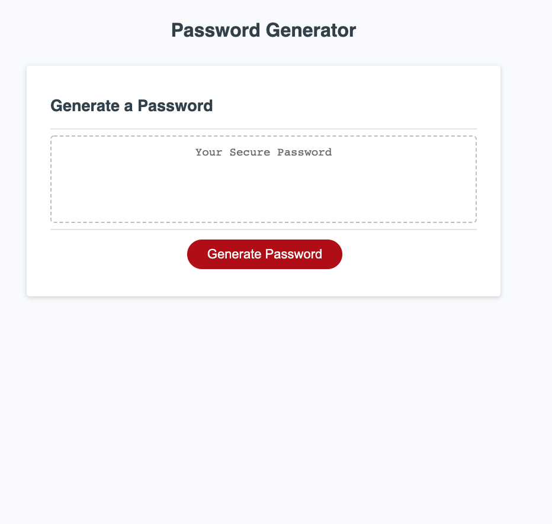

# Horiseon Website

## Purpose

Create a JavaScript function to generate a password, the function need to be asked to the user if include Lowercase, Uppercase, Numbers, and Special characters defined in  
https://owasp.org/www-community/password-special-characters

## Note

I log the final password object generated in the console, just for developments tracking.

## Built With

- Javascript
- Objects
- Properties and Methods.

## Website

https://joseduardo15062005.github.io/Password-Generator/

## Contribution

Made with ❤️ by [joseduardo]
